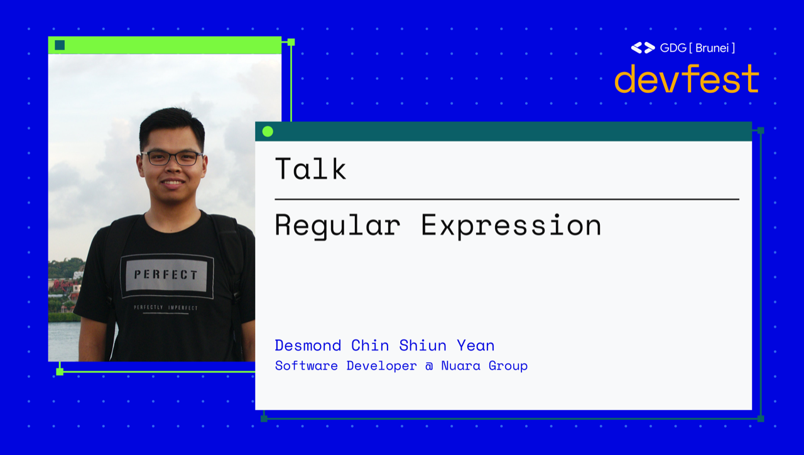

# GDG Brunei DevFest 2020 Talk: Regular Expression

Learn how to use regular expression (RegEx) to create search patterns and how you can use it to level up your development skills.

This talk is suitable for both beginners and intermediate levels! Attend GDG Brunei DevFest 2020 in-person at 📍Laksamana College of Business or 💻online on 18th Oct 2020. Catch Desmond at 11.15am-12pm UTC+8⏱

## Video Recording

Link to the video recording will be added here once available.

## Presentation Slides

[Click here to download](#)

## Resources

### Tutorials

1. https://regexone.com
1. https://www.freecodecamp.org/learn/javascript-algorithms-and-data-structures/regular-expressions/

### Videos

1. [Learn Regular Expressions (Regex) - Crash Course for Beginners](https://www.youtube.com/watch?v=ZfQFUJhPqMM)
1. [Learn Regular Expressions In 20 Minutes](https://www.youtube.com/watch?v=rhzKDrUiJVk)

### Regex Tester

1. https://regexr.com
1. https://regex101.com